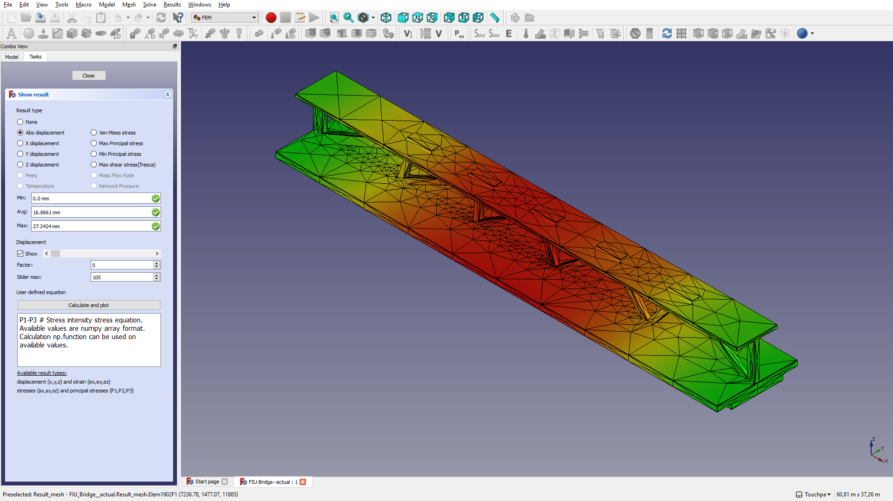
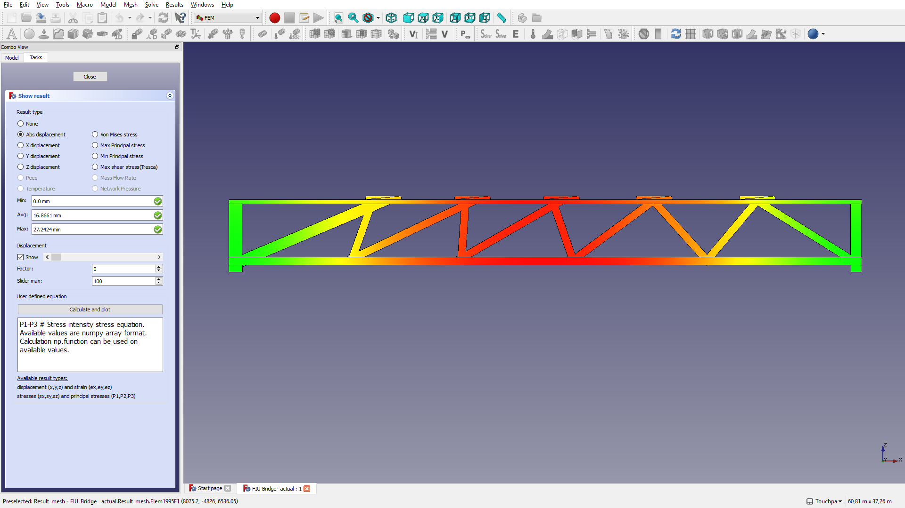
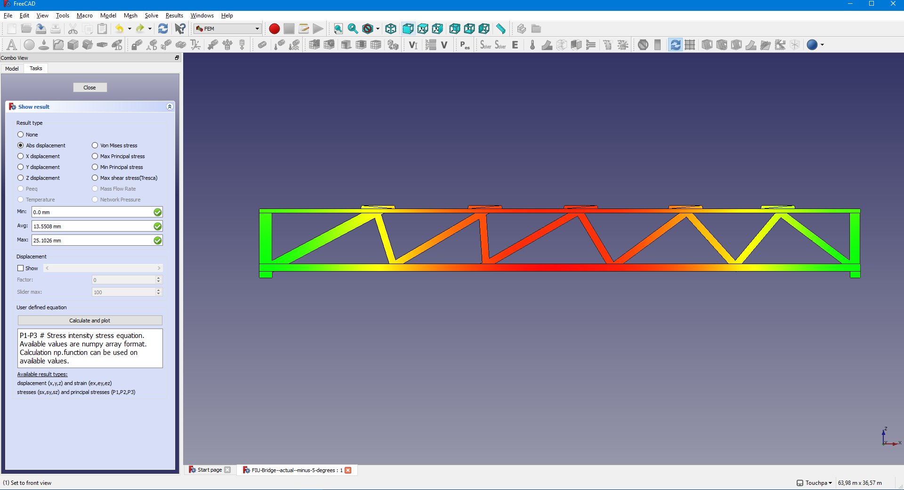
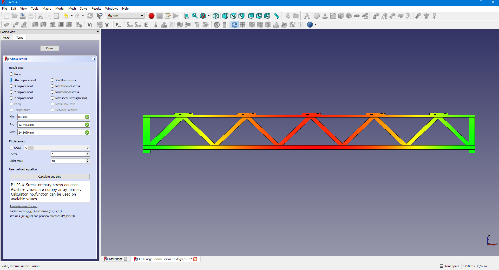
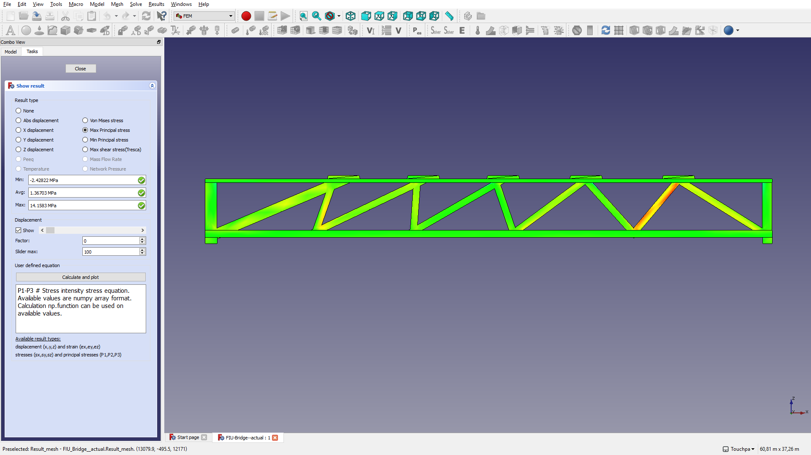
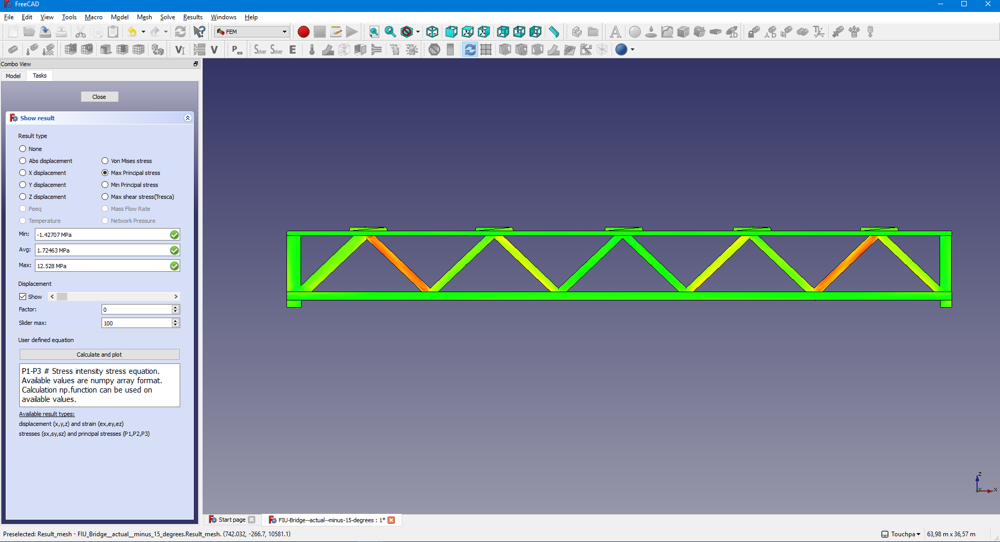
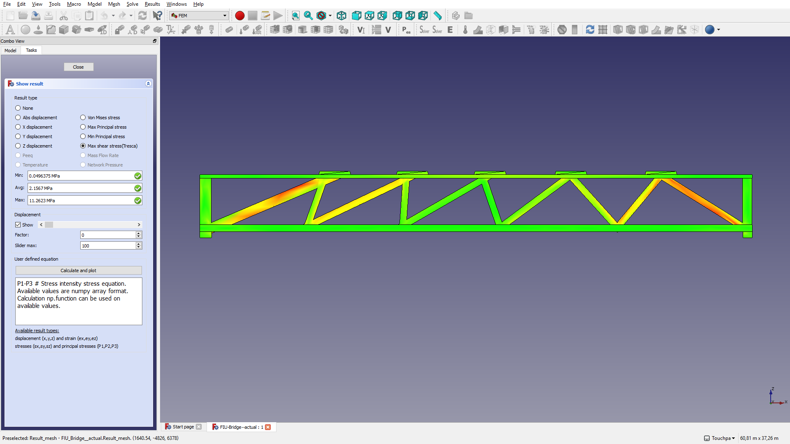
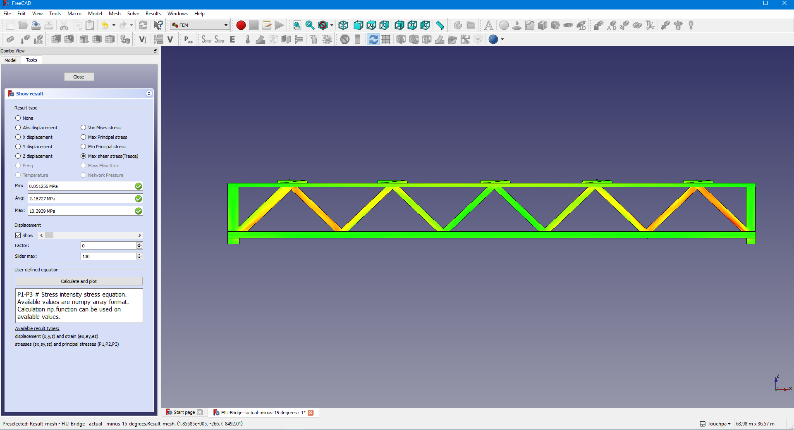
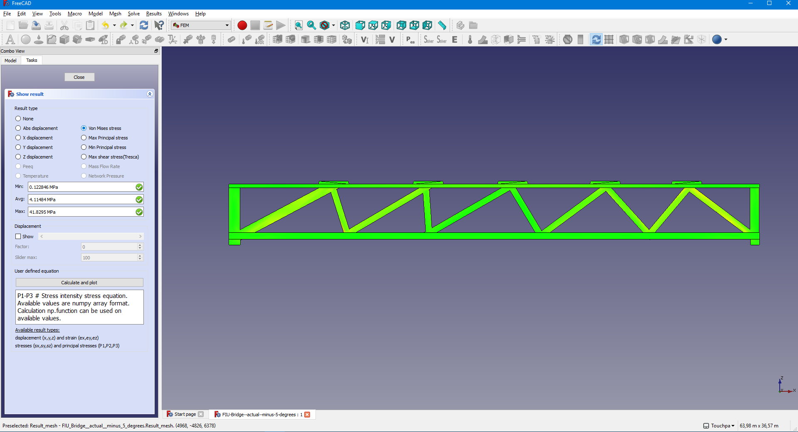
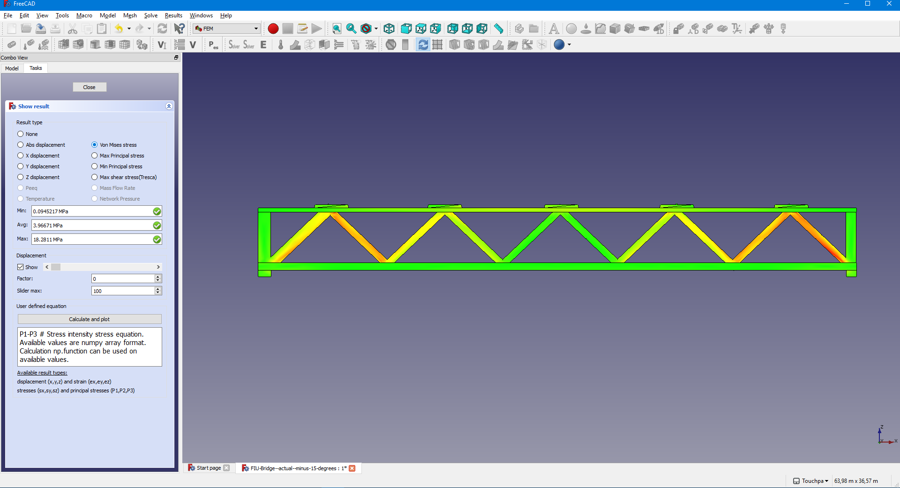

# fiu-bridge-collapse
##
Some CAD-modeling done for helping to understand the Florida International University ("FIU") pedestrian bridge collapse 2018-03-15.

The modeling is done in FreeCAD (see https://www.freecadweb.org/ for information and downloads).

## Images of the FreeCAD-FEM-output

3D-view of the bridge: 

| Output-Type | The actual bridge design | Actual design changed by 5 degrees | Actual design, changed to 46,5 deg. |"Standard" warren truss bridge design |
| ----------- | ------------------------ | ---------------------------------- | ----------------------------------- | ------------------------------------ |
| abs. displacement |  |  |  |  |
| max. principal stress |  | | |  |
| max. shear stress |  | | |  |
| Von Mises stress |  |  |  |  |

## Contact
Please contact brinkmann.michael@gmail.com if you have any issues / questions.

## Disclaimer
This project is a layman's work, calculations and data are known to be not exact in any way. 
More information is to be found in the License.
